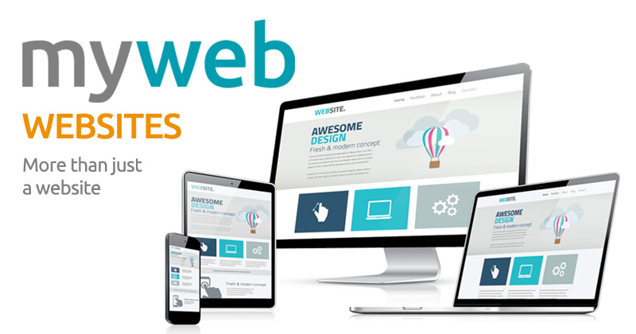

## Welcome to my Website

    Lorem Ipsum is simply dummy text of the printing and typesetting industry. Lorem Ipsum has been the industry's standard dummy text ever since the 1500s, when an unknown printer took a galley of type and scrambled it to make a type specimen book. It has survived not only five centuries, but also the leap into electronic typesetting, remaining essentially unchanged. It was popularised in the 1960s with the release of Letraset sheets containing Lorem Ipsum passages, and more recently with desktop publishing software like Aldus PageMaker including versions of Lorem Ipsum.

---

## 📚 Table of Contents

- [Features](#features)
- [Tech Stack](#tech-stack)
- [Installation](#installation)
- [Usage](#usage)
- [API Endpoints](#api-endpoints)
- [Environment Variables](#environment-variables)
- [Scripts](#scripts)
- [Contributing](#contributing)
- [Contributors](#contributors)
- [License](#license)

---

## ✨ Features

- Student & Teacher Management
- Class & Subject Assignment
- Attendance Tracking
- Exam Results
- User Authentication (JWT)
- Admin Dashboard

---

## 🛠 Tech Stack

- **Programming Language**: JavaScript (Node.js)
- **Runtime**: Node.js
- **Framework**: Express.js
- **Database**: MongoDB / Mongoose (or MySQL / Sequelize)
- **Authentication**: JSON Web Token (JWT)
- **Environment Management**: dotenv
- **Testing**: Jest / Mocha (optional)

---

## 👥 Contributors
